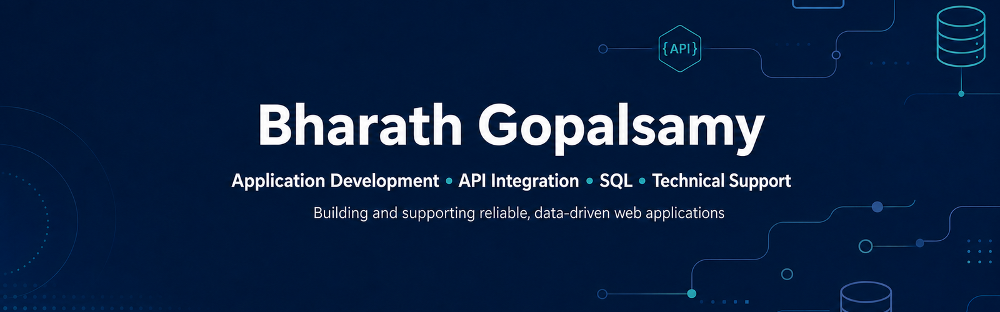
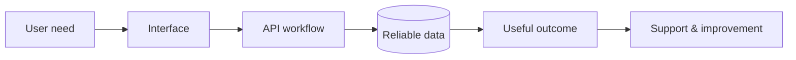

<p align="center">
  
</p>

<p align="center">
  <a href="https://readme-typing-svg.demolab.com">
    
  </a>
</p>

<p align="center">
  <a href="https://bharathgopalsamy.vercel.app"></a>
  <a href="https://linkedin.com/in/bharathgopalsamy"></a>
  <a href="mailto:bharathgopalswamy09@gmail.com"></a>
</p>

<p align="center">
  
  
  
</p>

## `> whoami`

I am an **application developer** who enjoys the full problem-solving path: understanding a user need, building the interface, connecting the API, validating the data, and supporting the finished workflow.

My background combines React and Node.js development, API integration, SQL and MongoDB, automated testing, analytics, technical documentation, and hands-on support for a production university website serving **5,000+ students**.

```javascript
const bharath = {
  builds: ["web applications", "REST APIs", "data workflows", "dashboards"],
  worksWith: ["React", "TypeScript", "Node.js", "SQL", "MongoDB", "Python"],
  caresAbout: ["reliability", "clear UX", "clean data", "useful documentation"],
  currentlyExploring: ["application support", "API quality", "Azure", "system design"],
  lookingFor: "A team where I can build, troubleshoot, learn, and contribute"
};
```

## What I bring

<table>
  <tr>
    <td width="25%" valign="top"><strong>Build</strong><br/><br/>Responsive React interfaces, reusable components, secure Node.js services, and end-to-end workflows.</td>
    <td width="25%" valign="top"><strong>Connect</strong><br/><br/>REST APIs, JWT authentication, OAuth 2.0, third-party services, and frontend/backend integration.</td>
    <td width="25%" valign="top"><strong>Understand</strong><br/><br/>SQL queries, normalized schemas, ETL pipelines, data validation, dashboards, and business-facing insights.</td>
    <td width="25%" valign="top"><strong>Support</strong><br/><br/>Issue investigation, browser debugging, API testing, stakeholder communication, and technical documentation.</td>
  </tr>
</table>

## Featured builds

<table>
  <tr>
    <td width="50%" valign="top">
      <h3>DermaCure</h3>
      <p>Full-stack healthcare workflow connecting patients and doctors through secure, role-based dashboards.</p>
      <p><code>React</code> <code>Node.js</code> <code>Express</code> <code>MongoDB</code> <code>JWT</code> <code>Docker</code></p>
      <ul>
        <li>Patient, doctor, and admin authorization</li>
        <li>Scan sharing and appointment workflows</li>
        <li>Doctor reviews and recommendations</li>
        <li>Vitest and React Testing Library coverage</li>
      </ul>
      <p><a href="https://derma-ai-psi.vercel.app"><strong>Live application</strong></a> · <a href="https://github.com/bharathgopalswamy/DermaAI"><strong>Source</strong></a></p>
    </td>
    <td width="50%" valign="top">
      <h3>HabitIQ</h3>
      <p>Habit analytics platform combining secure tracking, visual progress, and AI-assisted planning.</p>
      <p><code>React</code> <code>TypeScript</code> <code>Node.js</code> <code>MongoDB</code> <code>Gemini</code> <code>Recharts</code></p>
      <ul>
        <li>JWT-based user accounts</li>
        <li>Heatmaps, trends, scores, and risk summaries</li>
        <li>Personalized planning with history</li>
        <li>Responsive TypeScript interface</li>
      </ul>
      <p><a href="https://habitiq.vercel.app"><strong>Live application</strong></a> · <a href="https://github.com/bharathgopalswamy/smart-ai-habit-tracker"><strong>Source</strong></a></p>
    </td>
  </tr>
  <tr>
    <td width="50%" valign="top">
      <h3>Spotify Music Intelligence</h3>
      <p>API-to-dashboard analytics workflow built around a real music catalogue.</p>
      <p><code>Python</code> <code>Spotify API</code> <code>MySQL</code> <code>SQL</code> <code>Power BI</code></p>
      <ul>
        <li>ETL for 10 albums and 124 tracks</li>
        <li>Normalized album and track schema</li>
        <li>Popularity, duration, and release analysis</li>
        <li>Power BI and interactive web dashboards</li>
      </ul>
      <p><a href="https://spotify-music-intelligence-platform.vercel.app"><strong>Explore project</strong></a></p>
    </td>
    <td width="50%" valign="top">
      <h3>MedCare</h3>
      <p>Appointment-management system with relational data and calendar synchronization.</p>
      <p><code>Django</code> <code>Python</code> <code>MySQL</code> <code>Google Calendar API</code> <code>OAuth 2.0</code></p>
      <ul>
        <li>Patient appointment scheduling</li>
        <li>Google Calendar synchronization</li>
        <li>Secure authentication</li>
        <li>Administrative workflows</li>
      </ul>
      <p><a href="https://github.com/bharathgopalswamy/DoctorPatient"><strong>Source</strong></a></p>
    </td>
  </tr>
</table>

<p align="center">
  <a href="https://github.com/bharathgopalswamy/DermaAI">
    
  </a>
  <a href="https://github.com/bharathgopalswamy/smart-ai-habit-tracker">
    
  </a>
</p>

## Technology constellation

<p align="center">
  
</p>

| Layer | Tools I use |
|---|---|
| **Interfaces** | React, TypeScript, JavaScript, HTML, CSS, Tailwind CSS, Recharts |
| **Services** | Node.js, Express.js, Django, REST APIs, JWT, OAuth 2.0 |
| **Data** | SQL, MySQL, MongoDB, Python, Pandas, ETL, Power BI |
| **Quality** | Vitest, React Testing Library, Postman, debugging, data validation |
| **Delivery** | Git, GitHub, Docker, Vercel, Render, Agile workflows |

## From experience to impact



<details>
  <summary><strong>Website Coordinator · StFX Students' Union</strong></summary>
  <br/>
  Maintained a production website serving more than 5,000 students; investigated navigation, layout, mobile-responsiveness, and publishing issues; and translated stakeholder requests into reliable web updates.
</details>

<details>
  <summary><strong>Frontend Developer Intern · FirstLanguage Technologies</strong></summary>
  <br/>
  Built reusable React components for NLP analytics dashboards, integrated REST APIs, investigated application-state and rendering problems, and collaborated with backend engineers through Agile delivery and testing.
</details>

<details>
  <summary><strong>React Developer Intern · Banao Technologies</strong></summary>
  <br/>
  Converted wireframes into responsive interfaces, developed reusable forms and dashboard modules, integrated REST APIs, and helped troubleshoot frontend/backend integration issues.
</details>

## Live GitHub signal

<p align="center">
  
  
</p>

<p align="center">
  
</p>

<picture>
  <source media="(prefers-color-scheme: dark)" srcset="https://raw.githubusercontent.com/bharathgopalswamy/bharathgopalswamy/output/github-contribution-grid-snake-dark.svg" />
  <source media="(prefers-color-scheme: light)" srcset="https://raw.githubusercontent.com/bharathgopalswamy/bharathgopalswamy/output/github-contribution-grid-snake.svg" />
  
</picture>

## Right now

- Adding stronger automated and API testing to DermaCure.
- Learning deeper HTTP diagnostics, logging, Azure fundamentals, and enterprise integration patterns.
- Open to junior roles in **application development, application support, systems analysis, technical analysis, integration support, and full-stack development** across Canada.

<p align="center">
  <strong>Build the interface · Connect the API · Understand the data · Support the user</strong>
</p>

<p align="center">
  <a href="https://bharathgopalsamy.vercel.app">Portfolio</a> ·
  <a href="https://linkedin.com/in/bharathgopalsamy">LinkedIn</a> ·
  <a href="mailto:bharathgopalswamy09@gmail.com">Email</a>
</p>
